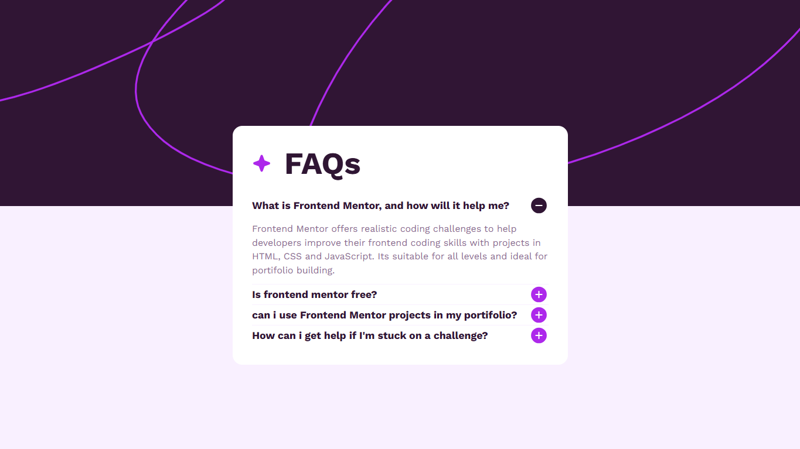

<h1 align="center"> FAQ Accordion </h1>

Plataforma do Projeto 
<a href="https://www.frontendmentor.io">Frontendementor</a>

 

  

## 🚀 Tecnologias

Esse projeto foi desenvolvido com as seguintes tecnologias:

- HTML e CSS
- JavaScript
- Git e Github

## ✏️ Dúvidas 

- Para percorrer as divs foi usado o... `tabindex="0" - Usando o seu valor zero em todas as divs colocado` 

Exemplo:

`
 div 
`

Fazendo com que ao pressionar o `TAB` seja colocado uma borda de destaque em cada div que recebe o `Focus` do `Tabindex="0"`